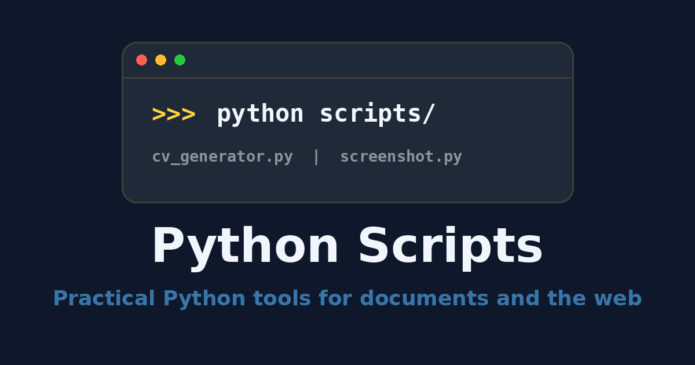

# Python Scripts

[](https://github.com/zlatanstajic/python_scripts/actions/workflows/ci.yml)
[](LICENSE.md)
[](https://zlatanstajic.github.io/python_scripts/)
[](https://www.python.org/)
[](https://pytest.org/)

> **Practical Python tools for documents and the web.**
> Two focused command-line utilities: one renders a single-page PDF CV from
> Markdown, the other captures 1600x900 website screenshots with Playwright.

📖 **Browse the docs:**
[zlatanstajic.github.io/python_scripts](https://zlatanstajic.github.io/python_scripts/)
(source in [`docs/`](docs/), published via GitHub Pages).

The repository's former general automation utilities now live in the sibling
[`shell-scripts`](https://github.com/zlatanstajic/shell-scripts) project.



## Table of Contents

- [Requirements](#requirements)
- [Development](#development)
- [Usage](#usage)
- [Configuration](#configuration)
- [Quality checks](#quality-checks)
- [Contributing](#contributing)
- [License](#license)

---

## Requirements

- Python 3.10 or newer
- WeasyPrint system libraries for PDF generation
- A Playwright Chromium browser for screenshots

[⬆ back to top](#table-of-contents)

---

## Development

Install the project in editable mode together with the browser runtime:

```bash
python -m venv .venv
source .venv/bin/activate
python -m pip install --upgrade pip
python -m pip install -e ".[dev]"
python -m playwright install chromium
cp .env.example .env
```

The install puts `cv-generator` and `website-screenshot` on the `PATH` of the
activated environment. Because the install is editable, edits under `scripts/`
take effect immediately for those commands — no reinstall is required.

The one exception is `[project.scripts]` in `pyproject.toml`: command names are
packaging metadata rather than source, so a new or renamed command only appears
after re-running `python -m pip install -e ".[dev]"`.

### Optional: user-level install with pipx

`pipx install .` places the same two commands in an isolated environment that
never needs activating. It is a good fit for `cv-generator`, which needs only
the WeasyPrint system libraries listed under [Requirements](#requirements).

No `pip` or `pipx` install ever provides the Chromium binary that
`website-screenshot` requires; only `python -m playwright install chromium`,
run with the interpreter of the environment that holds the command, does. That
step is not verified for a pipx-managed environment here, so use the virtual
environment above when you need `website-screenshot`.

[⬆ back to top](#table-of-contents)

---

## Usage

### CV generator

Set `MARKDOWN_FILE_URL` and `PDF_OUTPUT_LOCATION` in `.env`, then run:

```bash
cv-generator
```

`MARKDOWN_FILE_URL` may be a local path or `file://` URL. Relative input and
output paths are resolved from the current working directory.

### Website screenshots

Set `SCREENSHOT_SITES` to a comma-separated URL list and optionally set
`SCREENSHOT_OUTPUT_DIR` (the default is `~/Pictures`), then run:

```bash
website-screenshot
```

The tool runs Chromium headlessly and saves the visible 1600x900 viewport as a
JPEG named from each site's hostname — or, for GitHub Pages project sites, from
the repository name with underscores replaced by hyphens
(`https://username.github.io/my_project/` becomes `my-project.jpg`).
Both commands accept no options other than `-h`/`--help`; sites, inputs, and
output locations are configured only through `.env`.

Running the modules by file path is still supported and behaves identically:

```bash
python scripts/cv_generator.py
python scripts/screenshot.py
```

[⬆ back to top](#table-of-contents)

---

## Configuration

Both commands read `.env` from the **current working directory**, not from the
repository root and not from the installation directory. The file is loaded
with `override=False`, so real environment variables win over the values in the
file. A missing `.env` is a hard error.

```bash
cd ~/some/project && website-screenshot   # uses ~/some/project/.env
```

Every supported setting is documented in [`.env.example`](.env.example).

[⬆ back to top](#table-of-contents)

---

## Quality checks

```bash
python -m pytest tests/
python -m compileall -q scripts tests
python -m flake8 scripts/
python -m mypy scripts/
python -m pydocstyle scripts/
python -m bandit -r scripts/ -ll
python -m isort . --profile black --check-only --diff
python -m black . --check --diff
```

The pytest configuration measures coverage for `scripts/`. Build documentation
with warnings treated as errors using:

```bash
python -m sphinx -W -b html docs docs/_build/html
```

The social-preview image is generated deterministically by a committed Pillow
script and can be regenerated with:

```bash
python tools/gen-og-image.py  # requires Pillow
```

[⬆ back to top](#table-of-contents)

---

## Contributing

Contributions are welcome. See [CONTRIBUTING.md](CONTRIBUTING.md) for how to
propose a change.

[⬆ back to top](#table-of-contents)

---

## License

This project is licensed under the MIT License. See [LICENSE.md](LICENSE.md)
for details.

[⬆ back to top](#table-of-contents)
